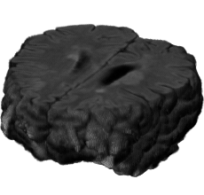
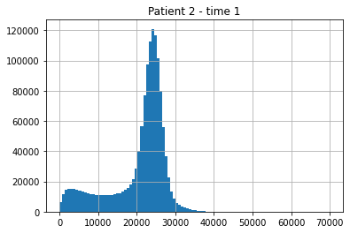
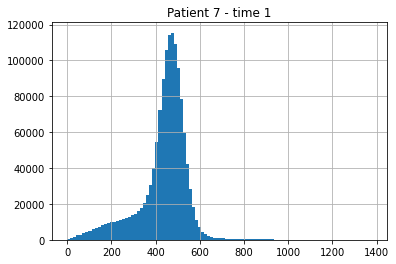
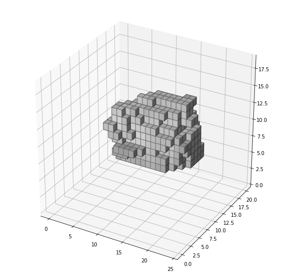
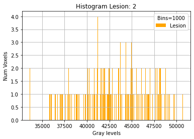
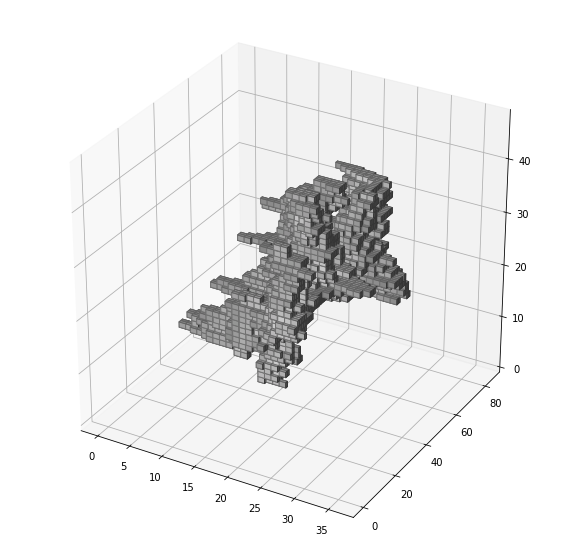
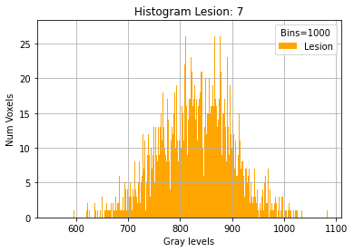

# Image 3D - Haralick in an amorphous region
MRI - Brain pre-processed <br /><br />
<b>Voxel size:</b>[1mm 1mm 1mm]<br /><br />
<b>Voxel Volume:</b> 1mm<sup>3</sup> <br /><br />
<b>FLAIR:</b> scale[0 64000], <b>data type:</b> Float<br /><br /> 

 <br /><br />


 <br /><br />

Patient 3 - Lesion 3.<br /><br />

 <br /><br />


Patient 7 - Lesion 7.<br /><br />

 <br /><br />

Podemos ver que al rango de los valores de grises en las imagenes es muy diferente y se encuentran en diferentes esacalas uno es [25000 65000] y el otro [400 1600]

## Quantization

Use the package manager [pip](https://pip.pypa.io/en/stable/) to install foobar.

```bash
pip install foobar
```

## Usage

```python
import foobar

foobar.pluralize('word') # returns 'words'
foobar.pluralize('goose') # returns 'geese'
foobar.singularize('phenomena') # returns 'phenomenon'
```

## Contributing
Pull requests are welcome. For major changes, please open an issue first to discuss what you would like to change.

Please make sure to update tests as appropriate.

## License
[MIT](https://choosealicense.com/licenses/mit/)
